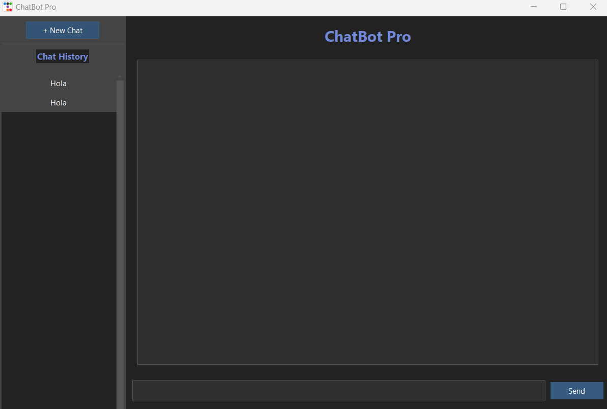
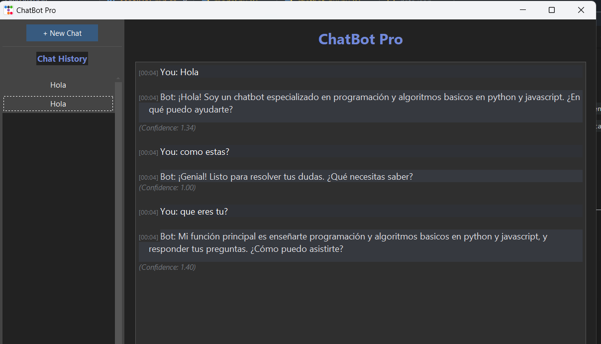

# Manual de Usuario del **ChatBot Pro**

Bienvenido al manual de usuario del **ChatBot Pro**. Este chatbot ha sido diseñado como una herramienta avanzada de asistencia que responde preguntas y guía a los usuarios en diversas consultas utilizando inteligencia artificial.

Para inicializar la app y ejecutarla:

```
pip install -r requirements.txt
python chatbot_gui.py
```

## Capacidades del ChatBot Pro

El **ChatBot Pro** puede interactuar y responder dudas relacionadas con una amplia gama de temas, incluyendo:

- **Conceptos de programación**: desde fundamentos como variables, condicionales y ciclos, hasta temas avanzados como programación orientada a objetos (OOP), herencia, polimorfismo, abstracción, etc
- **Python y Javascript**: preguntas sobre sus usos, instalación, ejecución de scripts, estructuras de control, bucles y otros conceptos clave del lenguaje, como generación de codigo.

## Idiomas

El chatbot tiene la capacidad de manejar consultas tanto en **español** como en **inglés**, permitiendo una experiencia bilingüe fluida para los usuarios.

## Información sobre el ChatBot Pro

Además de responder preguntas, el **ChatBot Pro** puede proporcionar detalles sobre su desarrollo, como las tecnologías utilizadas para su implementación. Está construido con:

- **Inteligencia artificial** basada en modelos LSTM.
- **Tecnologías clave**: TensorFlow, Transformers, sklearn,  Python y Tkinter.

## Uso del Manual

Este documento describe los pasos necesarios para interactuar con el chatbot y detalla sus funciones principales. Encontrarás guías prácticas, ejemplos de preguntas y descripciones de las respuestas esperadas para aprovechar al máximo esta herramienta.

## **Descripción de la Interfaz**




| **#** | **Elemento**                              | **Descripción**                                                                                                                                                   |
| ----- | ----------------------------------------- | ------------------------------------------------------------------------------------------------------------------------------------------------------------------ |
| 1     | **Campo de Respuesta del Chatbot**        | Muestra las respuestas generadas por el chatbot basadas en la entrada proporcionada por el usuario.                                                                |
| 2     | **Campo de Entrada del Chatbot**          | Mensajes que el usuario envío al chatbot, historial.                                                                                                              |
| 3     | **Cuadro de texto - Entrada del Usuario** | Área donde el usuario introduce sus mensajes o preguntas para interactuar con el chatbot.                                                                         |
| 4     | **Botón de Enviar**                      | Botón para enviar el mensaje ingresado por el usuario. Al hacer clic, el texto en el campo de entrada se envía al chatbot para procesar y generar una respuesta. |
| 5     | **Botón de Crear Nuevo Chat**            | Botón que permite crear nuevos chats.                                                                                                                             |

## **Guía de Uso**

### **Iniciar una Conversación**

1. Escribe tu mensaje o consulta en el **Campo de Entrada del Usuario** (Elemento 2).
2. Haz clic en el **Botón de Enviar** (Elemento 4) para enviar tu mensaje.
3. Observa la respuesta generada por el chatbot en el **Campo de Respuesta del Chatbot** (Elemento 3).
4. Si deseas comenzar una nueva conversación, haz clic en el **de cre Conversación** (Elemento 5).

## **Ejemplo de Interacción**

### Escenario 1: Saludo

- **Entrada del Usuario**: `Hola`.
- **Respuesta del Chatbot**: `¡Hola! ¿Qué tal?`.

### Escenario 2: Pregunta Técnica

- **Entrada del Usuario**: `¿Qué es python?`.
- **Respuesta del Chatbot**: `Python es ideal para principiantes y expertos, siendo utilizado en desarrollo web, análisis de datos, inteligencia artificial y más. ¿Quieres empezar por instalarlo?`.



## **Resolución de Problemas**

### **Problemas Comunes y Soluciones**

1. **El chatbot no responde**:
   - Verifica tu conexión a internet.
   - Reinicia la aplicación.
2. **Las respuestas no son claras o no aplican a la pregunta**:
   - Reformula tu pregunta o utiliza un lenguaje más específico.
3. **Error al enviar un mensaje**:
   - Asegúrate de que el campo de entrada no esté vacío.

## Topics

Aquí tienes el listado completo de los topics ordenados temáticamente:

**Interacción Básica**

- saludos (Saludos)
- identidad (Identidad)
- estado (Estado)

**Conceptos Básicos de Programación**

- programacion (Programación)
- algoritmos (Algoritmos)
- variables (Variables)
- constantes (Constantes)
- funciones (Funciones)
- lenguajes_programacion (Lenguajes de Programación)

**Estructuras de Control**

- ciclos (Ciclos)
- ciclo_for (Ciclo For)
- ciclo_while (Ciclo While)
- condiciones_if (Condiciones If)

**Programación Orientada a Objetos**

- programacion_orientada_objetos (Programación Orientada a Objetos)
- clases (Clases)
- objetos (Objetos)
- polimorfismo (Polimorfismo)
- herencia (Herencia)
- encapsulamiento (Encapsulamiento)
- abstraccion (Abstracción)

**Python**

- python_basico (Python Básico)
- python_instalacion (Instalación de Python)
- python_ejecucion (Ejecución en Python)
- python_inicio (Inicio en Python)
- variables_python (Variables en Python)
- constantes_python (Constantes en Python)
- funciones_python (Funciones en Python)
- clases_python (Clases en Python)
- objetos_python (Objetos en Python)
- ciclo_for_python (Ciclo For en Python)
- condiciones_if_python (Condiciones If en Python)
- ciclo_while_python (Ciclo While en Python)
- ciclos_python (Ciclos en Python)
- polimorfismo_python (Polimorfismo en Python)
- herencia_python (Herencia en Python)
- encapsulamiento_python (Encapsulamiento en Python)

**JavaScript**

- javascript-definicion (Definición de JavaScript)
- javascript-instalacion (Instalación de JavaScript)
- javascript_ejecucion (Ejecución en JavaScript)
- variables_javascript (Variables en JavaScript)
- diferencias_variables_javascript (Diferencias entre Variables en JavaScript)
- for_javascript (For en JavaScript)
- while_javascript (While en JavaScript)
- if_javascript (If en JavaScript)
- funciones_javascript (Funciones en JavaScript)
- clases_javascript (Clases en JavaScript)
- objetos_javascript (Objetos en JavaScript)
- polimorfismo_javascript (Polimorfismo en JavaScript)
- herencia_javascript (Herencia en JavaScript)
- encapsulamiento_javascript (Encapsulamiento en JavaScript)

**Lenguajes de Programación General**

- lenguajes_disponibles (Lenguajes Disponibles)
- lenguajes_populares (Lenguajes Populares)
- lenguajes_ia (Lenguajes para IA)

**Algoritmos y Estructuras de Datos**

- algoritmos_generales (Algoritmos Generales)
- algoritmos_busqueda (Algoritmos de Búsqueda)
- algoritmos_ordenamiento (Algoritmos de Ordenamiento)
- algoritmos_grafos (Algoritmos de Grafos)
- algoritmos_arboles (Algoritmos de Árboles)
- ordenamiento_burbuja (Ordenamiento Burbuja)
- ordenamiento_quicksort (Ordenamiento Quicksort)

**Ejemplos de Implementación**

- ejemplo_quicksort_python (Ejemplo Quicksort en Python)
- ejemplo_burbuja_python (Ejemplo Burbuja en Python)
- ejemplo_arboles_python (Ejemplo Árboles en Python)
- ejemplo_grafos_python (Ejemplo Grafos en Python)
- ejemplo_ordenamiento_python (Ejemplo Ordenamiento en Python)
- ejemplo_busqueda_python (Ejemplo Búsqueda en Python)
- quicksort_javascript (Quicksort en JavaScript)
- burbuja_javascript (Burbuja en JavaScript)
- arboles_javascript (Árboles en JavaScript)
- grafos_javascript (Grafos en JavaScript)
- ordenamiento_javascript (Ordenamiento en JavaScript)
- busqueda_javascript (Búsqueda en JavaScript)

**Ejemplos Específicos y Detalles de Implementación**

- funcion_suma_python (Función Suma en Python)
- calculo_suma_python (Cálculo Suma en Python)
- lectura_suma_python (Lectura Suma en Python)
- llamada_suma_python (Llamada Suma en Python)
- resultado_suma_python (Resultado Suma en Python)
- while_numero_secreto_python (While Número Secreto en Python)
- if_numero_secreto_python (If Número Secreto en Python)
- dataclass_python (Dataclass en Python)
- constructor_persona_python (Constructor Persona en Python)
- metodo_persona_python (Método Persona en Python)
- instancia_persona_python (Instancia Persona en Python)
- constructor_animal_python (Constructor Animal en Python)
- constructor_perro_python (Constructor Perro en Python)

**Detalles de Implementación de Algoritmos**

- if_quicksort_basico_python (If en Quicksort Básico Python)
- pivote_quicksort_basico_python (Pivote en Quicksort Básico Python)
- sublistas_quicksort_basico_python (Sublistas en Quicksort Básico Python)
- return_quicksort_basico_python (Return en Quicksort Básico Python)
- pivote_quicksort_optimizado_python (Pivote en Quicksort Optimizado Python)
- sublistas_quicksort_optimizado_python (Sublistas en Quicksort Optimizado Python)
- return_quicksort_optimizado_python (Return en Quicksort Optimizado Python)

**Implementación de Algoritmos Específicos**

- funcion_quicksort_indices_explicitos_python (Función Quicksort con Índices Explícitos en Python)
- if_quicksort_indices_explicitos_python (If en Quicksort con Índices Explícitos en Python)
- funcion_particion_indices_explicitos_python (Función Partición con Índices Explícitos en Python)
- pivote_particion_indices_explicitos_python (Pivote en Partición con Índices Explícitos en Python)
- for_indices_explicitos_python (For con Índices Explícitos en Python)
- if_particion_indices_explicitos_python (If en Partición con Índices Explícitos en Python)
- intercambio_particion_indices_explicitos_python (Intercambio en Partición con Índices Explícitos en Python)
- clase_nodo_arboles_python (Clase Nodo de Árboles en Python)
- constructor_nodo_python (Constructor de Nodo en Python)
- inorden_arboles_python (Recorrido Inorden de Árboles en Python)
