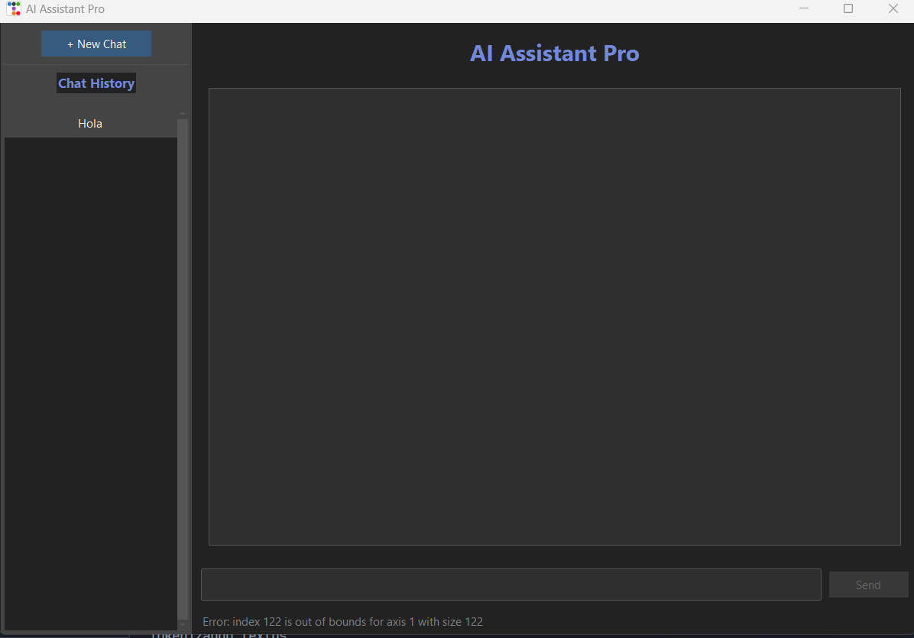

# Manual de Usuario del **ChatBot Pro**

Bienvenido al manual de usuario del **ChatBot Pro**. Este chatbot ha sido diseñado como una herramienta avanzada de asistencia que responde preguntas y guía a los usuarios en diversas consultas utilizando inteligencia artificial.

## Capacidades del ChatBot Pro

El **ChatBot Pro** puede interactuar y responder dudas relacionadas con una amplia gama de temas, incluyendo:

- **Conceptos de programación**: desde fundamentos como variables, condicionales y ciclos, hasta temas avanzados como programación orientada a objetos (OOP), herencia, polimorfismo y abstracción.
- **SQL**: comandos esenciales como `SELECT`, `WHERE`, `INSERT`, `UPDATE` y `DELETE`, además de conceptos relacionados con bases de datos, tipos de bases de datos (relacionales y no relacionales) y la estructura de tablas.
- **Python**: preguntas sobre sus usos, instalación, ejecución de scripts, estructuras de control, bucles y otros conceptos clave del lenguaje.
- **Temas casuales**: recomendaciones de actividades, frases de películas, chistes, sugerencias culinarias y más.

## Idiomas

El chatbot tiene la capacidad de manejar consultas tanto en **español** como en **inglés**, permitiendo una experiencia bilingüe fluida para los usuarios.

## Información sobre el ChatBot Pro

Además de responder preguntas, el **ChatBot Pro** puede proporcionar detalles sobre su desarrollo, como las tecnologías utilizadas para su implementación. Está construido con:

- **Inteligencia artificial** basada en modelos LSTM.
- **Tecnologías clave**: TensorFlow, Python y JavaScript.

## Uso del Manual

Este documento describe los pasos necesarios para interactuar con el chatbot y detalla sus funciones principales. Encontrarás guías prácticas, ejemplos de preguntas y descripciones de las respuestas esperadas para aprovechar al máximo esta herramienta.

---

## **Descripción de la Interfaz**

| **#** | **Elemento**                              | **Descripción**                                                                                                                                                   |
| ----- | ----------------------------------------- | ------------------------------------------------------------------------------------------------------------------------------------------------------------------ |
| 1     | **Campo de Respuesta del Chatbot**        | Muestra las respuestas generadas por el chatbot basadas en la entrada proporcionada por el usuario.                                                                |
| 2     | **Campo de Entrada del Chatbot**          | Mensajes que el usuario envío al chatbot, historial.                                                                                                              |
| 3     | **Cuadro de texto - Entrada del Usuario** | Área donde el usuario introduce sus mensajes o preguntas para interactuar con el chatbot.                                                                         |
| 4     | **Botón de Enviar**                      | Botón para enviar el mensaje ingresado por el usuario. Al hacer clic, el texto en el campo de entrada se envía al chatbot para procesar y generar una respuesta. |
| 5     | **Botón de Limpiar Conversación**       | Botón que permite borrar el historial de la conversación actual, reiniciando la interfaz para una nueva interacción.                                            |

---

## **Guía de Uso**

### **Iniciar una Conversación**

1. Escribe tu mensaje o consulta en el **Campo de Entrada del Usuario** (Elemento 2).
2. Haz clic en el **Botón de Enviar** (Elemento 4) para enviar tu mensaje.
3. Observa la respuesta generada por el chatbot en el **Campo de Respuesta del Chatbot** (Elemento 3).
4. Si deseas comenzar una nueva conversación, haz clic en el **Botón de Limpiar Conversación** (Elemento 5).

---

## **Ejemplo de Interacción**

### Escenario 1: Saludo

- **Entrada del Usuario**: `Hola`.
- **Respuesta del Chatbot**: `¡Hola! ¿Qué tal?`.

### Escenario 2: Pregunta Técnica

- **Entrada del Usuario**: `¿Qué es SQL?`.
- **Respuesta del Chatbot**: `SQL organiza, consulta y modifica datos en bases`.

---

## **Resolución de Problemas**

### **Problemas Comunes y Soluciones**

1. **El chatbot no responde**:
   - Verifica tu conexión a internet.
   - Reinicia la aplicación.
2. **Las respuestas no son claras o no aplican a la pregunta**:
   - Reformula tu pregunta o utiliza un lenguaje más específico.
3. **Error al enviar un mensaje**:
   - Asegúrate de que el campo de entrada no esté vacío.

---

# Lista de Topics Disponibles en el ChatBot

El chatbot puede responder preguntas y generar respuestas relacionadas con los siguientes **temas** o **topics**:

| **Topic**                  | **Descripción**                                                                                                | **Ejemplo de Entrada**                                      |
| -------------------------- | --------------------------------------------------------------------------------------------------------------- | ----------------------------------------------------------- |
| **saludos**                | Interacciones iniciales de bienvenida o saludo.                                                                 | "Hola, ¿cómo estás?"                                     |
| **estado**                 | Consultas sobre el estado emocional o físico del usuario.                                                      | "¿Cómo te sientes hoy?"                                   |
| **despedida**              | Frases para finalizar la interacción o conversación.                                                          | "Adiós, hasta luego."                                      |
| **agradecimiento**         | Expresiones de gratitud por la ayuda o interacción.                                                            | "Gracias por tu ayuda."                                     |
| **programacion**           | Preguntas generales sobre la programación y sus fundamentos.                                                   | "¿Qué es programación?"                                  |
| **variables**              | Consultas sobre el uso y propósito de las variables en programación.                                          | "¿Qué es una variable?"                                   |
| **condicionales**          | Preguntas relacionadas con estructuras de decisión en programación.                                           | "¿Qué hace un condicional?"                               |
| **ciclos**                 | Consultas sobre estructuras de repetición en programación.                                                    | "¿Cómo funcionan los bucles en Python?"                   |
| **funciones**              | Preguntas sobre el uso de funciones y métodos en programación.                                                | "¿Cuál es la diferencia entre una función y un método?" |
| **OOP**                    | Consultas sobre la programación orientada a objetos y sus principios.                                          | "¿Qué es la programación orientada a objetos?"           |
| **peliculas**              | Preguntas sobre películas, géneros o recomendaciones.                                                         | "¿Cuál es la mejor película de acción?"                 |
| **chistes**                | Solicitudes de chistes o contenido humorístico.                                                                | "¿Puedes contarme un chiste?"                              |
| **actividades**            | Solicitudes de recomendaciones de actividades o planes.                                                         | "¿Qué puedo hacer hoy?"                                   |
| **dialogos**               | Solicitudes de frases célebres o diálogos famosos.                                                            | "Dime un diálogo famoso de cine."                          |
| **cocina**                 | Consultas sobre ideas para preparar comida.                                                                     | "¿Qué receta me recomiendas?"                             |
| **sql**                    | Preguntas sobre SQL y bases de datos.                                                                           | "¿Qué es SQL?"                                            |
| **tipos**                  | Consultas sobre diferentes tipos de bases de datos.                                                             | "¿Qué tipos de bases de datos existen?"                   |
| **tabla**                  | Preguntas sobre tablas y su uso en bases de datos.                                                              | "¿Qué es una tabla en SQL?"                               |
| **select**                 | Consultas sobre el comando SELECT en SQL.                                                                       | "¿Cómo se usa SELECT en SQL?"                             |
| **where**                  | Preguntas sobre el uso de filtros en SQL con WHERE.                                                             | "¿Qué hace la cláusula WHERE?"                           |
| **existencial**            | Consultas sobre el propósito o identidad del chatbot.                                                          | "¿Cuál es tu propósito?"                                 |
| **insert**                 | Preguntas sobre el comando INSERT en SQL.                                                                       | "¿Cómo agregar datos con INSERT?"                         |
| **update**                 | Consultas sobre cómo actualizar datos en SQL con UPDATE.                                                       | "¿Qué hace el comando UPDATE?"                            |
| **delete**                 | Preguntas sobre la eliminación de datos en SQL con DELETE.                                                     | "¿Cómo se usa DELETE?"                                    |
| **python-basics-es**       | Preguntas básicas sobre Python y su propósito.                                                                | "¿Qué es Python?"                                         |
| **python-uses-es**         | Consultas sobre los usos y aplicaciones de Python.                                                              | "¿Para qué sirve Python?"                                 |
| **python-installation-es** | Preguntas sobre cómo instalar Python en diferentes sistemas.                                                   | "¿Cómo instalo Python en mi PC?"                          |
| **python-execution-es**    | Consultas sobre cómo ejecutar un programa en Python.                                                           | "¿Cómo corro un script en Python?"                        |
| **python-control-flow-es** | Preguntas sobre las estructuras de control en Python.                                                           | "¿Qué son los condicionales en Python?"                   |
| **python-loops-es**        | Consultas sobre bucles y su uso en Python.                                                                      | "¿Cómo funcionan los bucles en Python?"                   |
| **hello**                  | Greetings or initial conversation in English.                                                                   | "Hello, how are you?"                                       |
| **estado-en**              | Questions about emotional or physical state in English.                                                         | "How are you feeling today?"                                |
| **despedida-en**           | Phrases for ending the interaction or conversation in English.                                                  | "Goodbye, see you later."                                   |
| **agradecimiento-en**      | Expressions of gratitude for the help or interaction in English.                                                | "Thank you for your help."                                  |
| **sql-en**                 | Questions about SQL and databases in English.                                                                   | "What is SQL?"                                              |
| **types-en**               | Queries about types of databases in English.                                                                    | "What types of databases exist?"                            |
| **table-en**               | Questions about tables and their use in databases in English.                                                   | "What is a table in SQL?"                                   |
| **select-en**              | Queries about the SELECT command in SQL in English.                                                             | "How to use SELECT in SQL?"                                 |
| **where-en**               | Questions about filtering in SQL with WHERE in English.                                                         | "What does the WHERE clause do?"                            |
| **existential-en**         | Questions about the chatbot's purpose or identity in English.                                                   | "What is your purpose?"                                     |
| **insert-en**              | Questions about the INSERT command in SQL in English.                                                           | "How to add data with INSERT?"                              |
| **update-en**              | Queries about updating data in SQL with UPDATE in English.                                                      | "What does the UPDATE command do?"                          |
| **delete-en**              | Questions about deleting data in SQL with DELETE in English.                                                    | "How is DELETE used?"                                       |
| **python-basics-en**       | Basic questions about Python and its purpose in English.                                                        | "What is Python?"                                           |
| **python-uses-en**         | Questions about uses and applications of Python in English.                                                     | "What is Python used for?"                                  |
| **python-installation-en** | Questions about installing Python on different systems in English.                                              | "How do I install Python on my PC?"                         |
| **python-execution-en**    | Questions about running a Python program in English.                                                            | "How do I run a Python script?"                             |
| **python-control-flow-en** | Queries about control flow structures in Python in English.                                                     | "What are conditionals in Python?"                          |
| **python-loops-en**        | Questions about loops and their use in Python in English.                                                       | "How do loops work in Python?"                              |
| **hello**                  | Interacciones iniciales de saludo o bienvenida. Las preguntas se pueden realizar en inglés.                    | "Hello, how are you?"                                       |
| **estado-en**              | Consultas sobre el estado emocional o físico del usuario. Las preguntas se pueden realizar en inglés.         | "How are you feeling today?"                                |
| **despedida-en**           | Frases para finalizar la interacción o conversación. Las preguntas se pueden realizar en inglés.             | "Goodbye, see you later."                                   |
| **agradecimiento-en**      | Expresiones de gratitud por la ayuda o interacción. Las preguntas se pueden realizar en inglés.               | "Thank you for your help."                                  |
| **sql-en**                 | Preguntas sobre SQL y bases de datos. Las preguntas se pueden realizar en inglés.                              | "What is SQL?"                                              |
| **types-en**               | Consultas sobre tipos de bases de datos. Las preguntas se pueden realizar en inglés.                           | "What types of databases exist?"                            |
| **table-en**               | Preguntas sobre tablas y su uso en bases de datos. Las preguntas se pueden realizar en inglés.                 | "What is a table in SQL?"                                   |
| **select-en**              | Consultas sobre el comando SELECT en SQL. Las preguntas se pueden realizar en inglés.                          | "How to use SELECT in SQL?"                                 |
| **where-en**               | Preguntas sobre el uso de filtros en SQL con WHERE. Las preguntas se pueden realizar en inglés.                | "What does the WHERE clause do?"                            |
| **existential-en**         | Consultas sobre el propósito o identidad del chatbot. Las preguntas se pueden realizar en inglés.             | "What is your purpose?"                                     |
| **insert-en**              | Preguntas sobre el comando INSERT en SQL. Las preguntas se pueden realizar en inglés.                          | "How to add data with INSERT?"                              |
| **update-en**              | Consultas sobre cómo actualizar datos en SQL con UPDATE. Las preguntas se pueden realizar en inglés.          | "What does the UPDATE command do?"                          |
| **delete-en**              | Preguntas sobre la eliminación de datos en SQL con DELETE. Las preguntas se pueden realizar en inglés.        | "How is DELETE used?"                                       |
| **python-basics-en**       | Preguntas básicas sobre Python y su propósito. Las preguntas se pueden realizar en inglés.                   | "What is Python?"                                           |
| **python-uses-en**         | Consultas sobre los usos y aplicaciones de Python. Las preguntas se pueden realizar en inglés.                 | "What is Python used for?"                                  |
| **python-installation-en** | Preguntas sobre cómo instalar Python en diferentes sistemas. Las preguntas se pueden realizar en inglés.      | "How do I install Python on my PC?"                         |
| **python-execution-en**    | Consultas sobre cómo ejecutar un programa en Python. Las preguntas se pueden realizar en inglés.              | "How do I run a Python script?"                             |
| **python-control-flow-en** | Preguntas sobre las estructuras de control en Python. Las preguntas se pueden realizar en inglés.              | "What are conditionals in Python?"                          |
| **python-loops-en**        | Consultas sobre bucles y su uso en Python. Las preguntas se pueden realizar en inglés.                         | "How do loops work in Python?"                              |
| **inheritance**            | Preguntas sobre herencia en programación orientada a objetos. Las preguntas se pueden realizar en inglés.     | "What does inheritance mean in programming?"                |
| **abstraction**            | Consultas sobre abstracción en programación orientada a objetos. Las preguntas se pueden realizar en inglés. | "What is abstraction in OOP?"                               |
| **polymorphism**           | Preguntas sobre polimorfismo en programación orientada a objetos. Las preguntas se pueden realizar en inglés. | "What does polymorphism mean in OOP?"                       |
| **getter-en**              | Consultas sobre getters y su uso en programación. Las preguntas se pueden realizar en inglés.                 | "What is a getter in programming?"                          |
| **setter-en**              | Preguntas sobre setters y su propósito en programación. Las preguntas se pueden realizar en inglés.          | "What is a setter and what is it used for?"                 |
| **friends**                | Consultas sobre actividades recreativas con amigos. Las preguntas se pueden realizar en inglés.                | "I'm going out with friends."                               |
